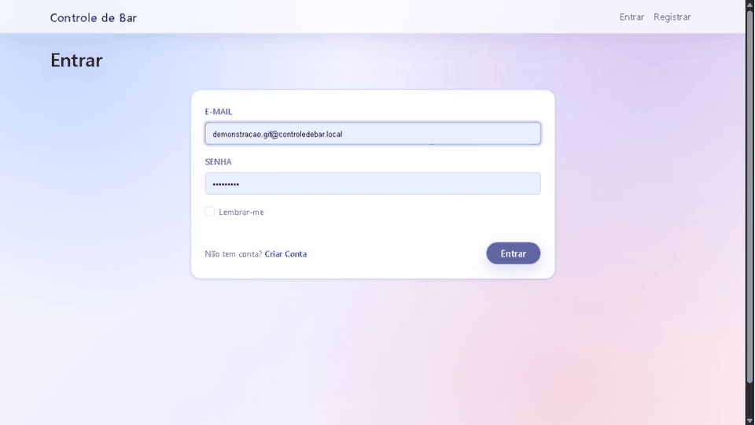

# 🍺 Controle de Bar

<p align="center">
  Sistema web para gerenciamento de estabelecimentos, desenvolvido com ASP.NET Core MVC, Entity Framework Core e arquitetura em camadas.
</p>

<p align="center">
  
</p>

<p align="center">
  
  
  
  
</p>

<p align="center">
  
  
  
  
</p>

---

## 🌐 Aplicação publicada

A aplicação está disponível publicamente no **Microsoft Azure**:

### [➡️ Acessar Controle de Bar](https://controledebar-fpeff9cbdna9bzhs.canadacentral-01.azurewebsites.net)

A aplicação utiliza **Azure App Service** para hospedagem e **Azure SQL Database** para persistência dos dados em produção.

Credenciais, connection strings e demais informações sensíveis são configuradas diretamente no ambiente de produção e **não são armazenadas no repositório**.

---

## 📑 Sumário

- [Sobre o projeto](#-sobre-o-projeto)
- [Funcionalidades](#-funcionalidades)
- [Regras de negócio](#-regras-de-negócio)
- [Tecnologias](#-tecnologias)
- [Arquitetura](#-arquitetura)
- [Pré-requisitos](#-pré-requisitos)
- [Configuração local](#️-configuração-local)
- [Migrations](#️-migrations)
- [Executando a aplicação](#-executando-a-aplicação)
- [Testes](#-testes)
- [Integração contínua](#-integração-contínua)
- [Publicação no Azure](#️-publicação-no-azure)
- [Demonstração](#️-demonstração)

---

## 📖 Sobre o projeto

O **Controle de Bar** é uma aplicação web multi-tenant desenvolvida para auxiliar no gerenciamento das principais operações de um bar ou estabelecimento semelhante.

O sistema centraliza o gerenciamento de:

- mesas;
- garçons;
- produtos;
- contas;
- pedidos;
- faturamento.

Cada usuário possui seu próprio ambiente dentro da aplicação. Os dados são isolados por estabelecimento, impedindo que informações cadastradas por um usuário sejam visualizadas ou manipuladas por outro.

---

## ✨ Funcionalidades

### 🔐 Autenticação

- Registro de usuários;
- Login;
- Logout;
- Proteção de páginas que exigem autenticação;
- Isolamento dos dados entre usuários.

### 🪑 Mesas

- Cadastro;
- Listagem;
- Edição;
- Exclusão;
- Controle de status `Livre` e `Ocupada`;
- Controle da quantidade de lugares.

### 👨‍🍳 Garçons

- Cadastro;
- Listagem;
- Edição;
- Exclusão.

### 🍔 Produtos

- Cadastro;
- Listagem;
- Edição;
- Exclusão;
- Definição de preço;
- Busca de produtos por nome.

### 🧾 Contas e pedidos

- Abertura de contas;
- Associação entre conta, mesa e garçom;
- Múltiplas contas abertas na mesma mesa;
- Inclusão de produtos em uma conta;
- Definição da quantidade dos pedidos;
- Remoção de pedidos;
- Cálculo automático de subtotal;
- Cálculo do total da conta;
- Fechamento da conta.

### 💰 Faturamento

- Consulta de faturamento por data;
- Consideração apenas de contas fechadas;
- Utilização dos valores efetivamente praticados no momento do pedido.

---

## 📋 Regras de negócio

O sistema implementa regras para garantir a consistência das operações e o isolamento dos estabelecimentos.

| Regra | Comportamento |
|---|---|
| **Multi-tenancy** | Os registros pertencem ao usuário autenticado e são filtrados por `UserId`. |
| **Mesas** | O número da mesa deve ser único para cada usuário. |
| **Garçons** | O nome do garçom deve ser único para cada usuário. |
| **Produtos** | O nome do produto deve ser único para cada usuário. |
| **Integridade** | Mesas, garçons e produtos vinculados não podem ser excluídos indevidamente. |
| **Múltiplas contas** | Uma mesma mesa pode possuir mais de uma conta aberta. |
| **Mesa ocupada** | A mesa permanece ocupada enquanto existir pelo menos uma conta aberta. |
| **Liberação da mesa** | A mesa volta ao estado livre após o fechamento da última conta aberta. |
| **Conta fechada** | Não permite inclusão ou remoção de pedidos. |
| **Snapshot** | O pedido preserva o nome e o preço praticado do produto no momento da inclusão. |
| **Subtotal** | `PrecoPraticado × Quantidade`. |
| **Total da conta** | Soma dos subtotais dos pedidos. |
| **Faturamento** | Considera somente contas fechadas na respectiva `DataFechamento`. |

---

## 🛠 Tecnologias

| Categoria | Tecnologia |
|---|---|
| Linguagem | C# |
| Plataforma | .NET 10 |
| Framework Web | ASP.NET Core MVC |
| ORM | Entity Framework Core 10.0.9 |
| Persistência local | SQL Server LocalDB |
| Persistência em produção | Azure SQL Database |
| Autenticação | ASP.NET Core Identity 10.0.9 |
| Mapeamento | AutoMapper 16.1.1 |
| Resultados de operações | FluentResults 4.0.0 |
| Logging | Serilog 10.0.0 |
| Testes | MSTest 4.0.2 |
| Mocks | Moq 4.20.72 |
| Testes E2E | Playwright MSTest 1.61.0 |
| Testes relacionais | SQLite / EF Core SQLite 10.0.9 |
| CI | GitHub Actions |
| Cloud | Microsoft Azure |
| Hospedagem | Azure App Service |

> **Nota:** SQLite é utilizado exclusivamente nos testes de integração que precisam validar constraints relacionais reais. Os demais testes de integração e E2E utilizam bancos InMemory isolados.

---

## 🏗 Arquitetura

O projeto utiliza uma arquitetura em camadas, separando regras de negócio, casos de uso, persistência e apresentação.

```text
                    ┌───────────────────────┐
                    │   ControleDeBar.WebApp│
                    │    ASP.NET Core MVC   │
                    └───────────┬───────────┘
                                │
                    ┌───────────▼───────────┐
                    │ ControleDeBar.Aplicacao│
                    │ Serviços / Casos de Uso│
                    └───────────┬───────────┘
                                │
                    ┌───────────▼───────────┐
                    │ ControleDeBar.Dominio │
                    │ Entidades / Contratos │
                    └───────────────────────┘

                    ┌───────────────────────┐
                    │  ControleDeBar.Infra  │
                    │ EF Core / Identity /  │
                    │ Repositórios / SQL    │
                    └───────────────────────┘
```

### Estrutura da solução

```text
ControleDeBar.slnx
│
├── src/
│   ├── ControleDeBar.Dominio/
│   │   └── Entidades, regras e contratos
│   │
│   ├── ControleDeBar.Aplicacao/
│   │   └── Serviços, DTOs e casos de uso
│   │
│   ├── ControleDeBar.Infra/
│   │   └── EF Core, repositórios, Identity e migrations
│   │
│   └── ControleDeBar.WebApp/
│       └── Controllers, ViewModels, Views e configuração
│
└── tests/
    ├── ControleDeBar.Testes.Unidade/
    ├── ControleDeBar.Testes.Integracao/
    └── ControleDeBar.Testes.E2E/
```

O **Domínio** concentra as regras centrais da aplicação. A camada de **Aplicação** coordena os casos de uso. A **Infraestrutura** implementa persistência e serviços técnicos, enquanto a **WebApp** disponibiliza a interface MVC e realiza a composição das dependências.

---

## 📦 Pré-requisitos

Para executar o projeto localmente:

- [.NET SDK 10](https://dotnet.microsoft.com/);
- SQL Server LocalDB;
- `dotnet-ef` 10.0.9;
- Git;
- Chromium via Playwright, caso os testes E2E sejam executados.

Para instalar a ferramenta do Entity Framework Core:

```powershell
dotnet tool install --global dotnet-ef --version 10.0.9
```

---

## ⚙️ Configuração local

### 1. Clone o repositório

```powershell
git clone <URL_DO_REPOSITORIO>
cd controle-de-bar-2026
```

### 2. Restaure as dependências

```powershell
dotnet restore ControleDeBar.slnx
```

### 3. Configure o banco de dados

Em `Development`, a aplicação utiliza a connection string:

```text
SqlServerEF
```

A configuração padrão está localizada em:

```text
src/ControleDeBar.WebApp/appsettings.Development.json
```

Por padrão, o ambiente de desenvolvimento utiliza:

```text
Servidor: (localdb)\MSSQLLocalDB
Banco:    ControleDeBarDB
```

Para outros ambientes, configure:

```text
ConnectionStrings:SqlServerEF
```

por meio de **User Secrets**, variáveis de ambiente ou configurações do provedor de hospedagem.

> [!IMPORTANT]
> Nunca versione senhas, connection strings de produção, tokens ou outras credenciais no repositório.

---

## 🗃️ Migrations

O projeto possui **6 migrations** do Entity Framework Core.

A migration mais recente é:

```text
20260824043501_Add_Modulo_Pedido
```

Para criar ou atualizar o banco local:

```powershell
dotnet ef database update `
  --project src/ControleDeBar.Infra/ControleDeBar.Infra.csproj `
  --startup-project src/ControleDeBar.WebApp/ControleDeBar.WebApp.csproj
```

As migrations configuram o schema necessário para:

- ASP.NET Core Identity;
- Mesas;
- Garçons;
- Produtos;
- Contas;
- Pedidos.

Em ambiente `Development`, a aplicação também aplica migrations pendentes durante a inicialização.

---

## ▶️ Executando a aplicação

Execute:

```powershell
dotnet run --project src/ControleDeBar.WebApp/ControleDeBar.WebApp.csproj
```

No perfil HTTP de desenvolvimento:

```text
http://localhost:8001
```

---

## 🧪 Testes

O projeto possui três níveis de testes automatizados.

| Suíte | Testes | Finalidade |
|---|---:|---|
| 🧩 Unitários | **128** | Domínio e serviços de aplicação |
| 🔗 Integração | **60** | EF Core, repositórios, relacionamentos e multi-tenancy |
| 🌐 E2E | **60** | Fluxos completos através da interface |
| **Total** | **248** | **248 aprovados** |

### 🧩 Testes unitários

```powershell
dotnet test tests/ControleDeBar.Testes.Unidade/ControleDeBar.Testes.Unidade.csproj -v minimal
```

Com cobertura:

```powershell
dotnet test tests/ControleDeBar.Testes.Unidade/ControleDeBar.Testes.Unidade.csproj `
  --collect:"XPlat Code Coverage" `
  -v minimal
```

O relatório é gerado no formato Cobertura:

```text
coverage.cobertura.xml
```

### 🔗 Testes de integração

```powershell
dotnet test tests/ControleDeBar.Testes.Integracao/ControleDeBar.Testes.Integracao.csproj -v minimal
```

Esses testes validam, entre outros cenários:

- CRUD dos repositórios;
- persistência;
- relacionamentos;
- multi-tenancy;
- integridade referencial;
- snapshot dos pedidos;
- consistência após falhas.

### 🌐 Testes E2E

Os testes ponta a ponta utilizam **Microsoft Playwright** com Chromium.

Primeiro compile em Release:

```powershell
dotnet build ControleDeBar.slnx --configuration Release
```

Instale o Chromium:

```powershell
pwsh tests/ControleDeBar.Testes.E2E/bin/Release/net10.0/playwright.ps1 install chromium
```

Execute:

```powershell
dotnet test tests/ControleDeBar.Testes.E2E/ControleDeBar.Testes.E2E.csproj -v minimal
```

### ✅ Executar todos os testes

```powershell
dotnet test ControleDeBar.slnx -v minimal
```

Última validação:

```text
Unitários     128 / 128
Integração     60 / 60
E2E            60 / 60
──────────────────────
Total         248 / 248
```

---

## 🔄 Integração contínua

O projeto utiliza **GitHub Actions** para validação automática.

Workflow:

```text
.github/workflows/ci.yml
```

O pipeline é executado automaticamente em:

- `push`;
- `pull_request`.

### Fluxo do CI

```text
Checkout
   ↓
Setup .NET 10
   ↓
Restore
   ↓
Build Release
   ↓
Instalação do Chromium
   ↓
Testes Unitários + Cobertura
   ↓
Testes de Integração
   ↓
Testes E2E
   ↓
Artifacts
```

São disponibilizados na execução:

- resultados `.trx` através do artifact `test-results`;
- cobertura `coverage.cobertura.xml` através do artifact `code-coverage`.

Falhas de compilação ou testes interrompem o pipeline.

---

## ☁️ Publicação no Azure

A aplicação está publicada utilizando serviços da Microsoft Azure.

```text
              GitHub
                 │
                 ▼
        Azure App Service
                 │
                 ▼
        ASP.NET Core MVC
                 │
                 ▼
       Azure SQL Database
```

A connection string de produção utiliza a chave:

```text
SqlServerEF
```

As credenciais são configuradas diretamente no ambiente do Azure e permanecem fora do código-fonte.

### 🌐 Ambiente de produção

**[Acessar aplicação publicada →](https://controledebar-fpeff9cbdna9bzhs.canadacentral-01.azurewebsites.net)**

---

## 🖼️ Demonstração

### Wireframe da aplicação


### Fluxo e relacionamentos


> Os materiais acima apresentam a estrutura visual, os relacionamentos e os principais fluxos previstos para o sistema.

---

## 📊 Status do projeto

| Item | Status |
|---|:---:|
| Aplicação Web | ✅ |
| Autenticação | ✅ |
| Mesas | ✅ |
| Garçons | ✅ |
| Produtos | ✅ |
| Contas e Pedidos | ✅ |
| Faturamento | ✅ |
| Multi-tenancy | ✅ |
| Testes Unitários | ✅ |
| Testes de Integração | ✅ |
| Testes E2E | ✅ |
| Pipeline CI | ✅ |
| Azure App Service | ✅ |
| Azure SQL Database | ✅ |

---

# 👨‍💻 Autor

**Gustavo Tessaro e Alec Luí**

Projeto desenvolvido como prática de desenvolvimento de aplicações web utilizando **ASP.NET Core MVC**, aplicando conceitos de arquitetura em camadas, boas práticas de programação e padrões modernos de desenvolvimento.

Caso tenha gostado do projeto, deixe uma ⭐ no repositório.

---

# 📄 Licença

Este projeto foi desenvolvido para fins acadêmicos e de estudo.

Sinta-se à vontade para utilizá-lo como referência, respeitando os créditos ao autor.

---

<div align="center">

## ⭐ Se este projeto foi útil para você, considere deixar uma estrela no repositório!

</div>
